# Sahil-Website
A Blog website made with HTML, CSS, PHP & JavaScript.

<u><h3>Demo Video</h3></u>
<a href="https://www.youtube.com/watch?v=p0ZD13yOLqM&t=71s" target="_blank">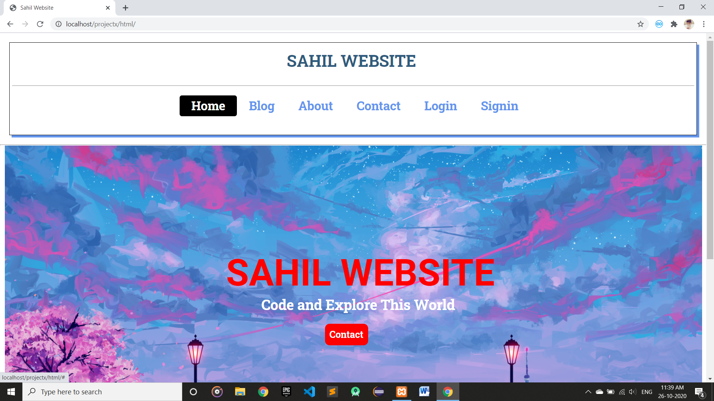</a>

<h1>Setup</h1>
<u><h3>Php Setup:-</h3></u>
1. Downlaod and Install Xampp <a href="https://www.apachefriends.org/download.html" target="_blank">Click here.</a> 
2. After Install, Start Apache and MySql. 
3. After that, go to your browser and search localhost/phpmyadmin . 
4. After that create a new Database name projectx. 
5. In projectx db create tables name users, post and about. 
6. In users make columns : id, username, varchar, name, email, mobile, password. 
7. In post make columns : id, title, des, img, content, date.  
8. In about make colums : id, img, title, des. 

<u><h3>Screenshots:-</h3></u>
<h4>Home Page</h4>

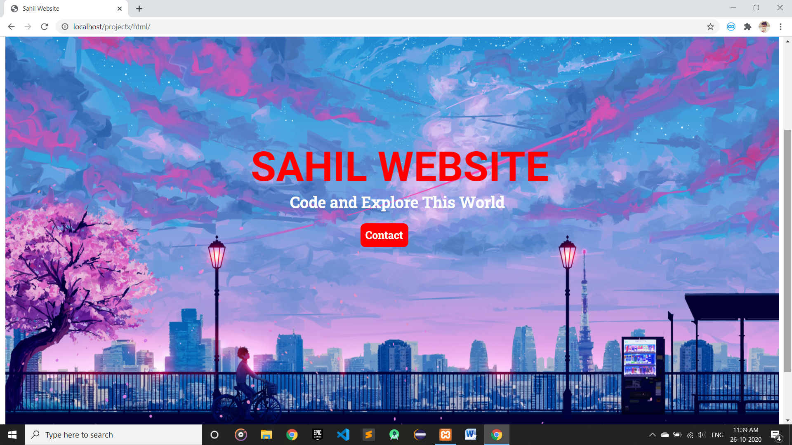
 
<h4>Blog Page</h4>
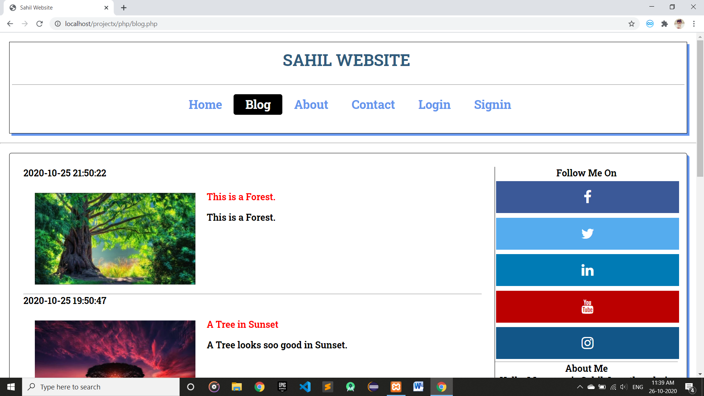
 
<h4>About Page</h4>
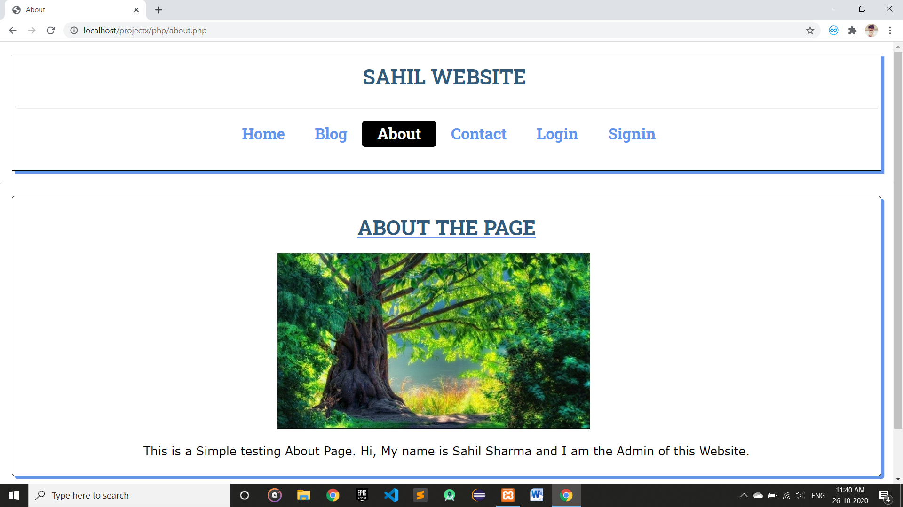
 
<h4>Contact Page</h4>
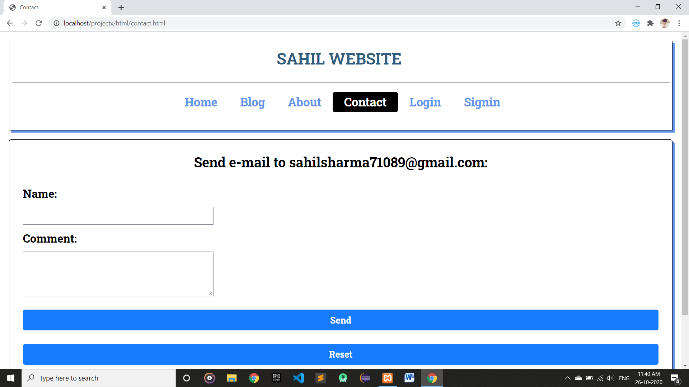
 
<h4>Login Page</h4>
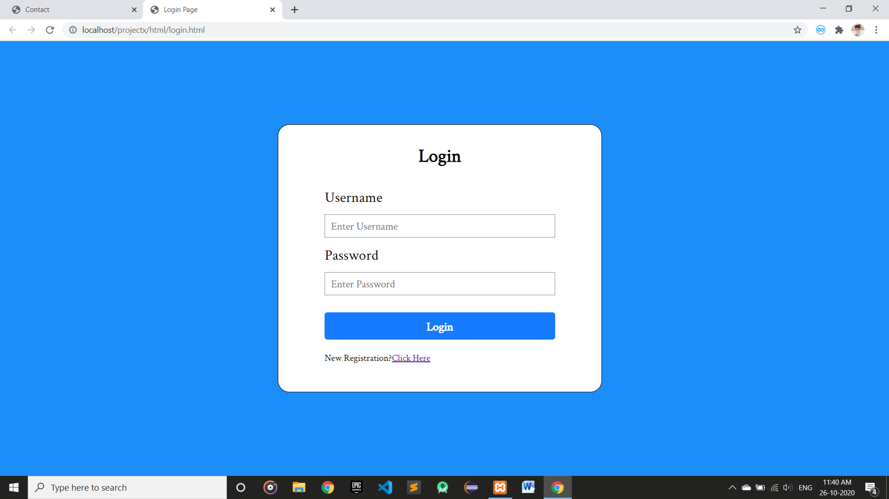
 
<h4>SignUp Page</h4>
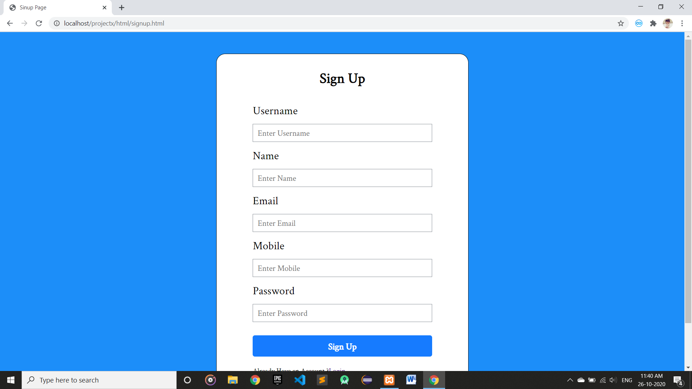
 

<h2>Admin Panel</h2>
<h4>Dashboard</h4>
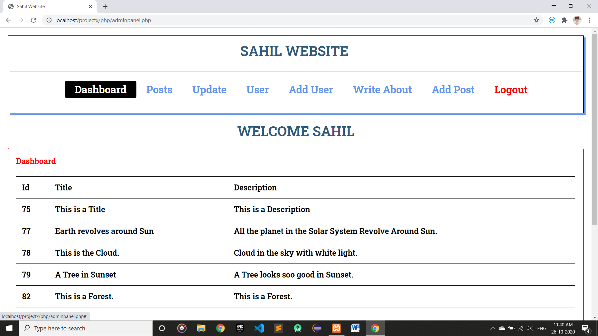
 
<h4>Posts Panel</h4>
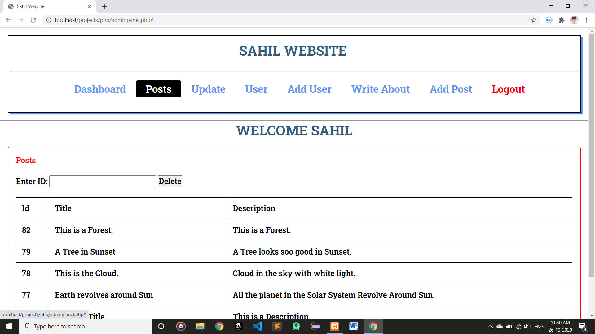
 
<h4>Update Panel</h4>
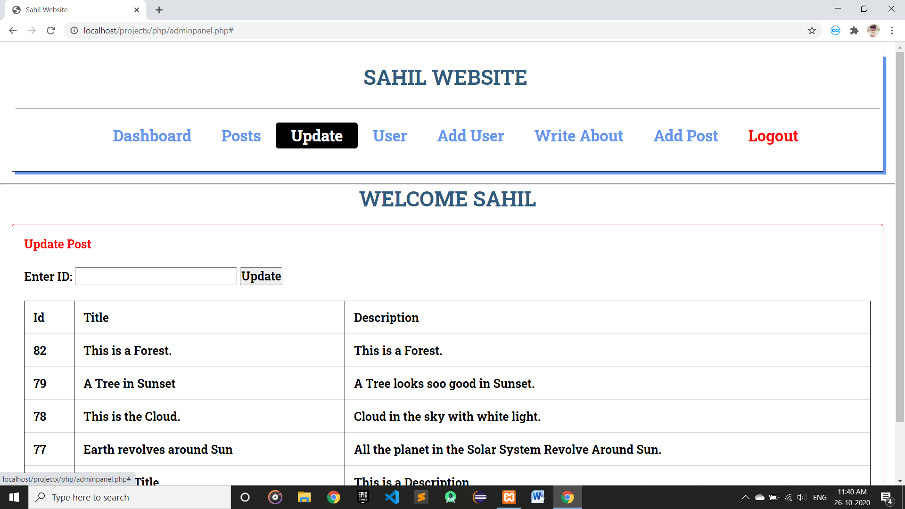
 
<h4>Users Panel</h4>
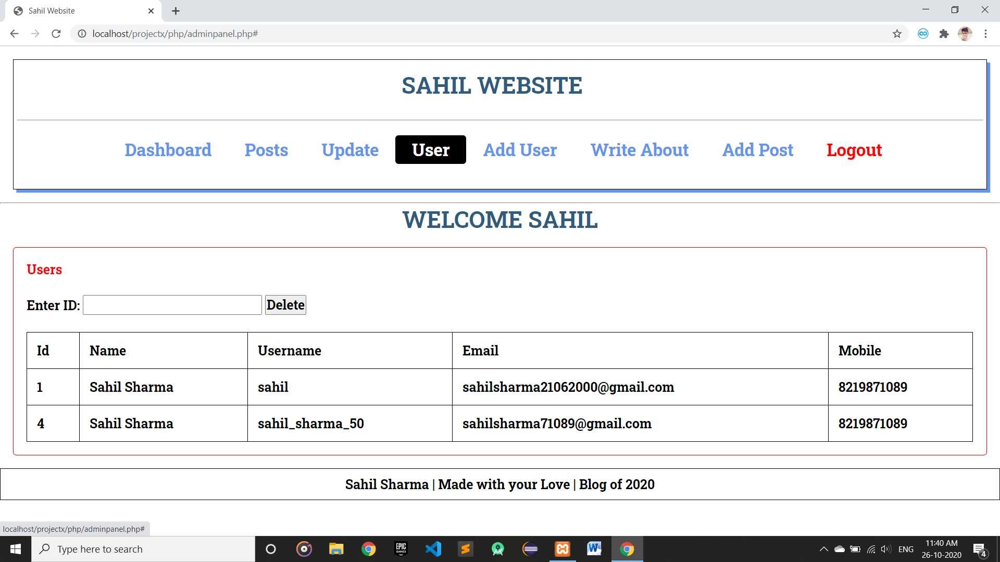
 
<h4>Add About Page</h4>
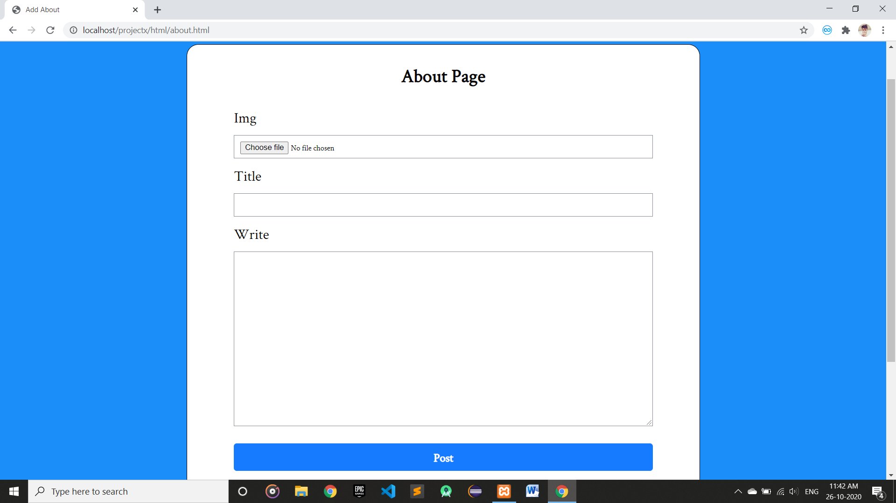
 
<h4>Add Post</h4>
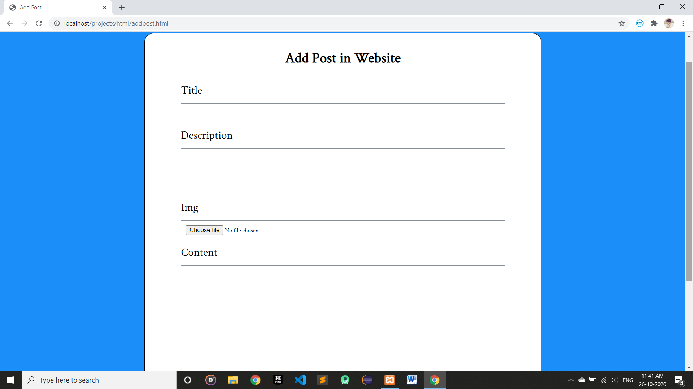
 
<h4>Logout</h4>
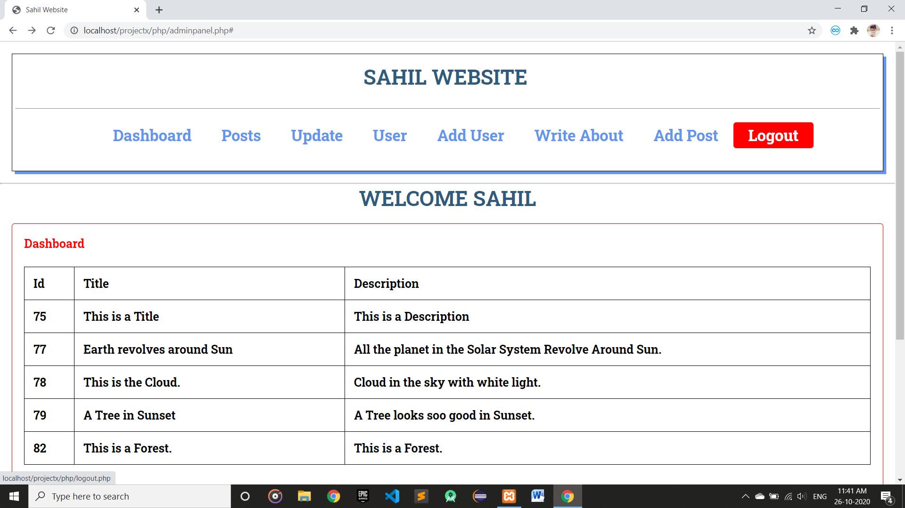
 
<h4>Redirect to : Home Page</h4>

